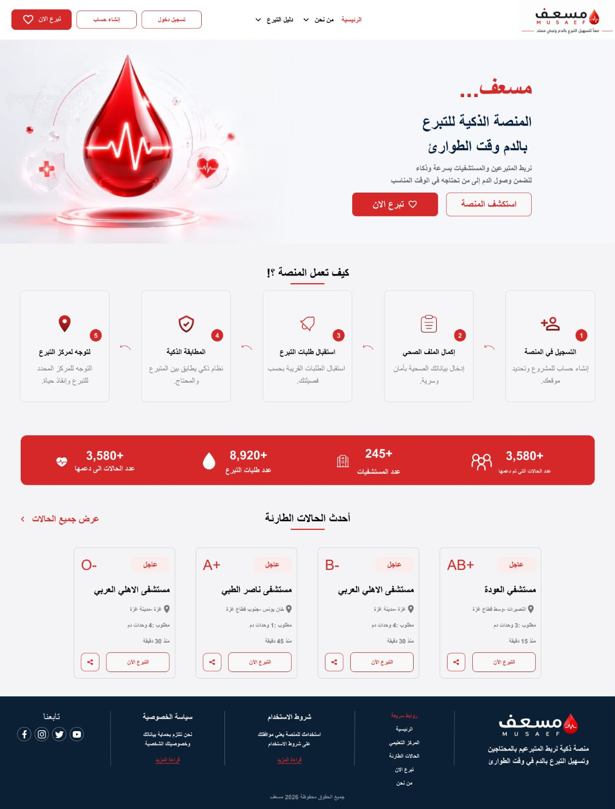
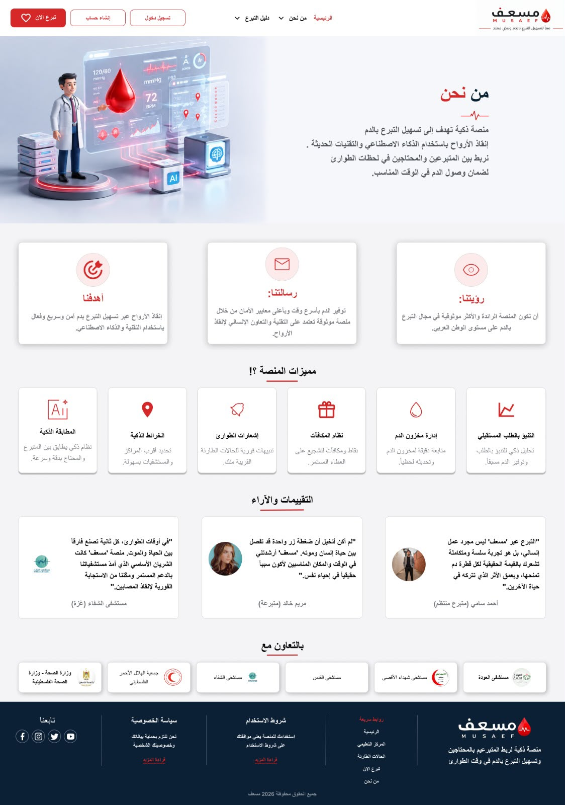
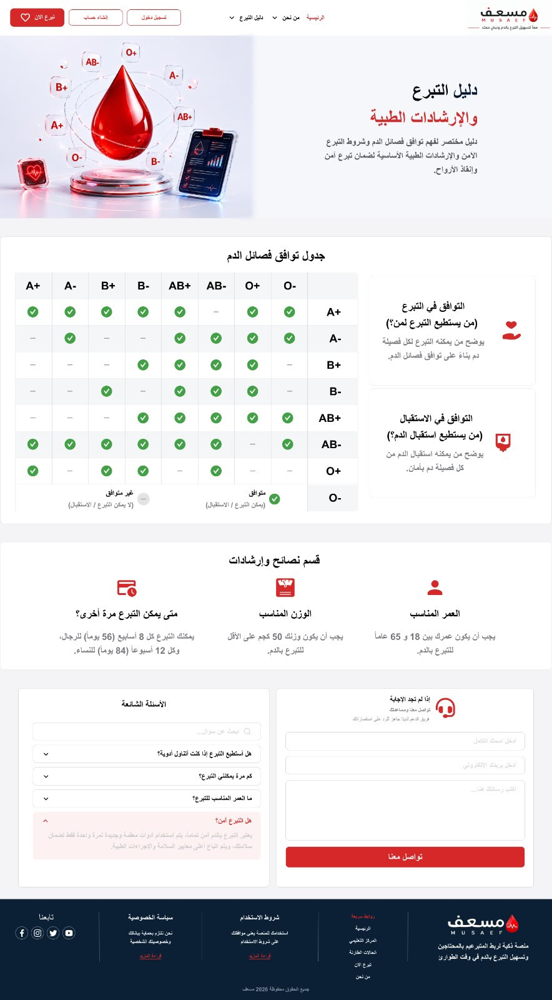
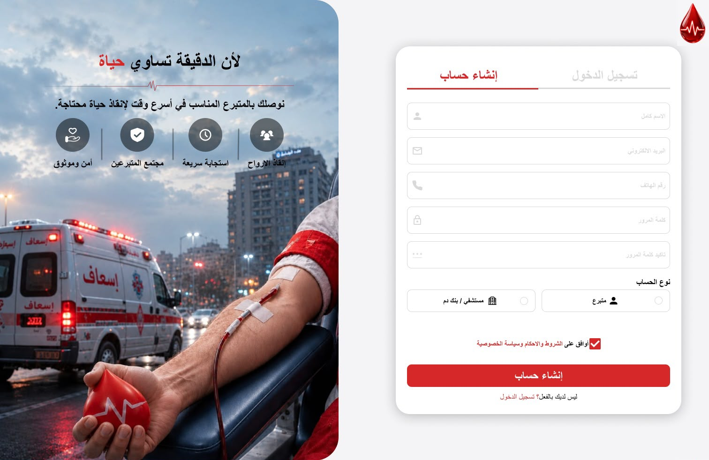
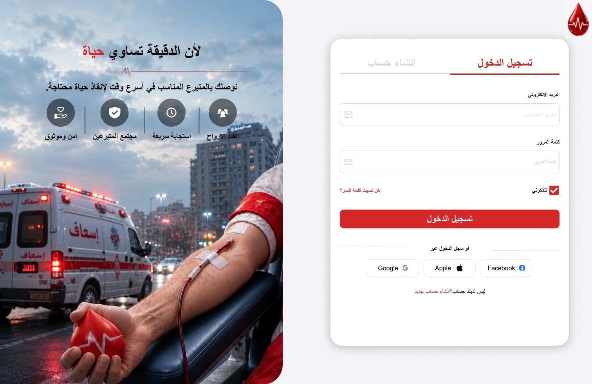

# 🩸 Musaef Platform | منصة مسعف

**Musaef** is a promising digital ecosystem designed to streamline and organize the blood donation process. It connects donors with patients and hospitals in real time during critical medical emergencies using smart and rapid workflows.

---

## 🌟 Key Features

- ⚡ **Rapid Emergency Response:** Instant matching and connection between donors and recipients during critical situations.
- 🩸 **Blood Compatibility Guide:** Comprehensive reference matrix detailing blood type compatibility for safe donation and reception.
- 🏥 **Hospital Integration:** Real-time tracking and management of emergency blood requests across healthcare centers and hospitals.
- 🔒 **Security & Privacy:** Full confidentiality and protection for donor and recipient personal data.

---

## 📸 Interface Screenshots

### 1. Home Page


### 2. About Us


### 3. Donation Guide & Compatibility Matrix


### 4. Sign Up


### 5. Login Page


---

## 🛠️ Tech Stack

- **Frontend Framework:** Vue.js 3 / Vite / HTML5 / CSS3 / JavaScript
- **State Management & Routing:** Pinia / Vue Router
- **UI & Styling:** Bootstrap 5 / Custom CSS Variables
- **Localization:** Vue I18n (Dynamic RTL/LTR Support for Arabic & English)
- **Version Control:** Git & GitHub

---

## 🚀 Setup & Local Development

This project requires **Node.js (v18 or higher)**.

### 1. Clone the Repository:
```bash
git clone [https://github.com/atya10/musaef-platform.git](https://github.com/atya10/musaef-platform.git)
cd musaef-platform
